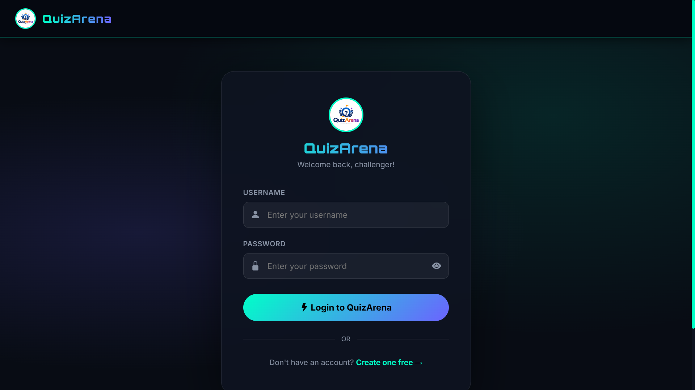
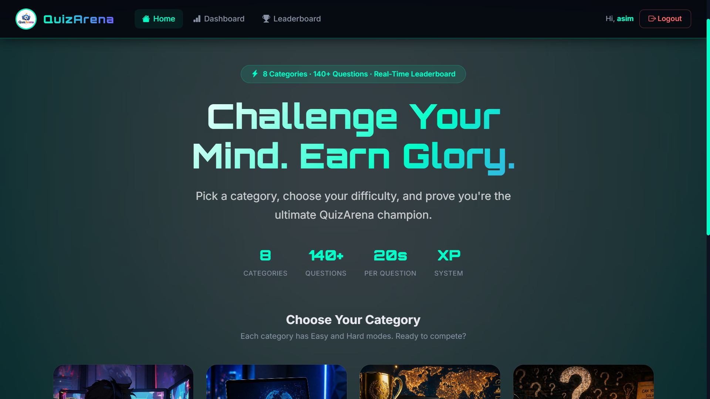
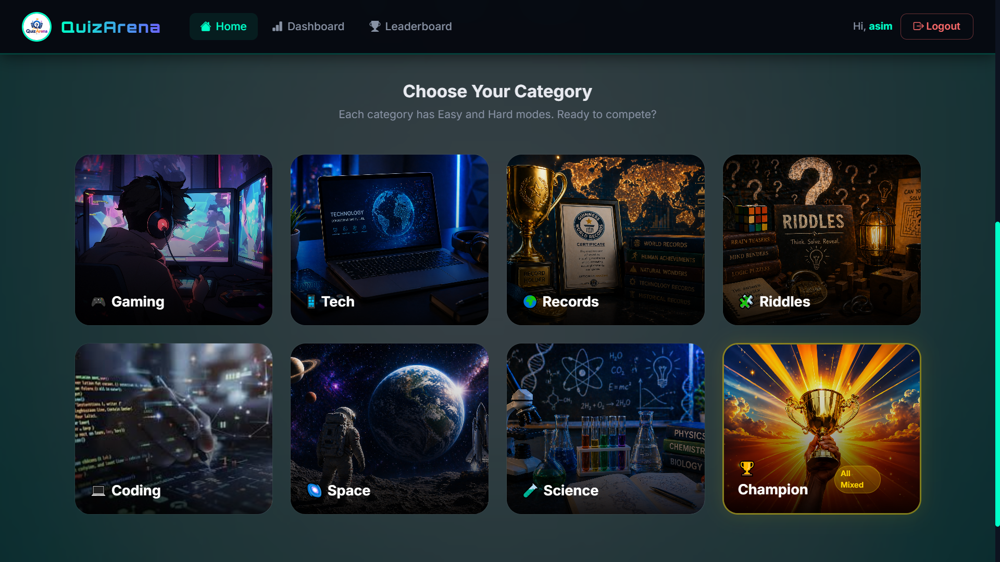
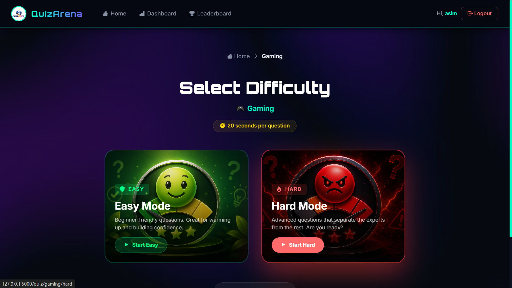
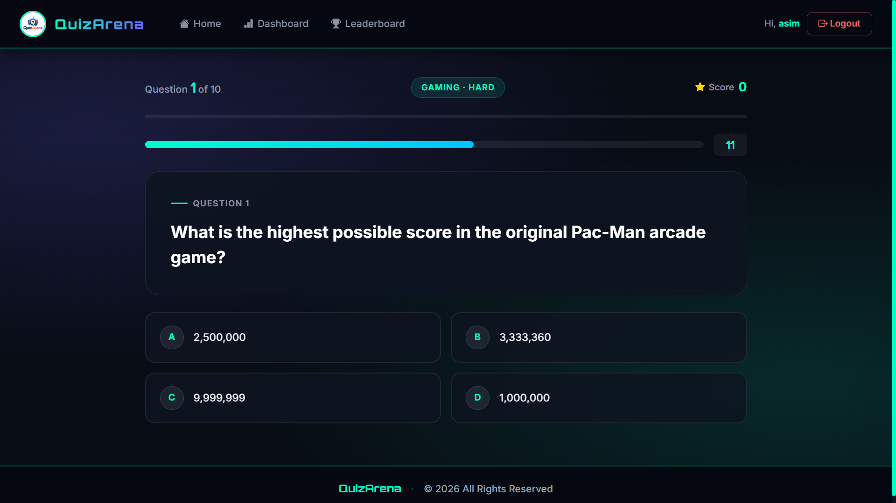
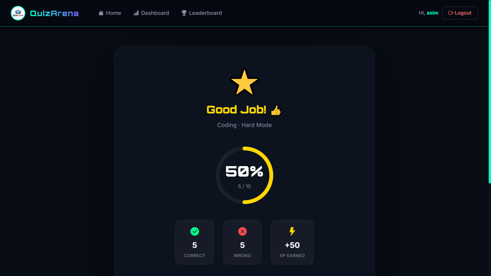
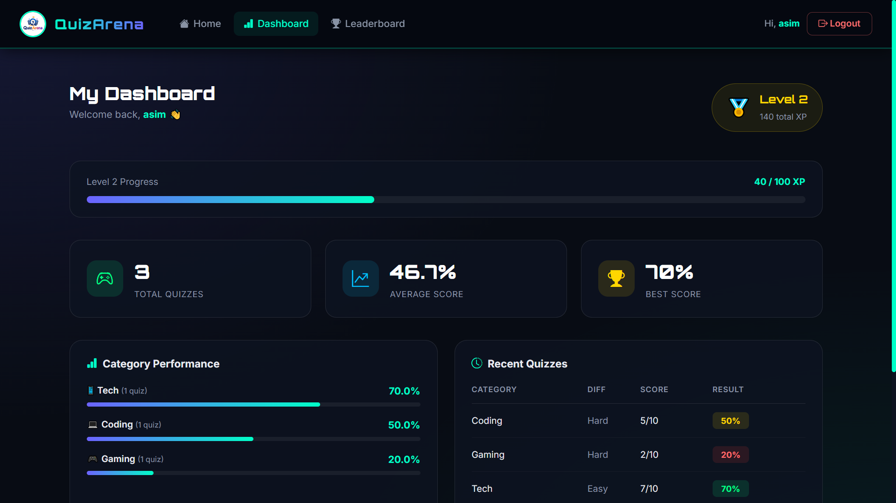
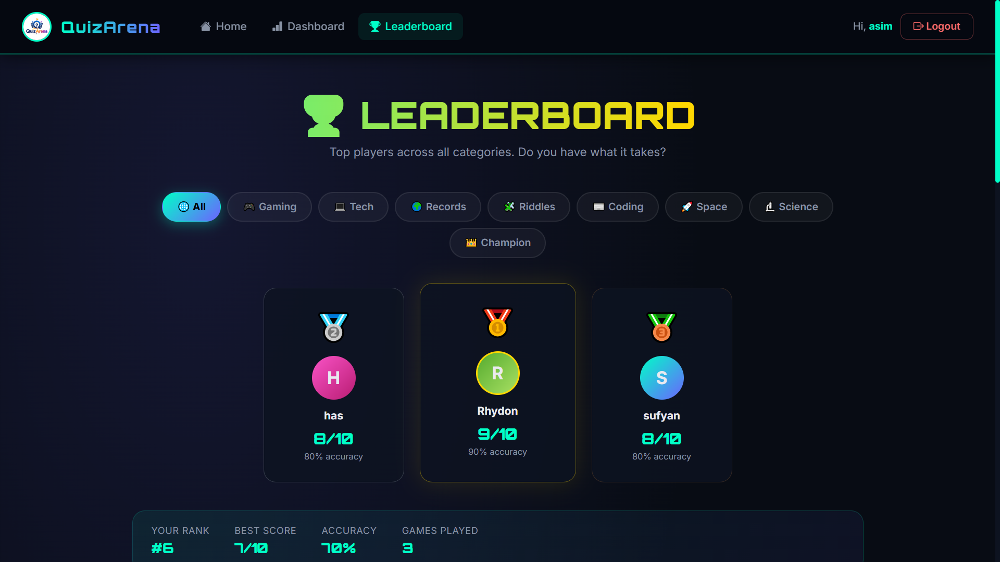
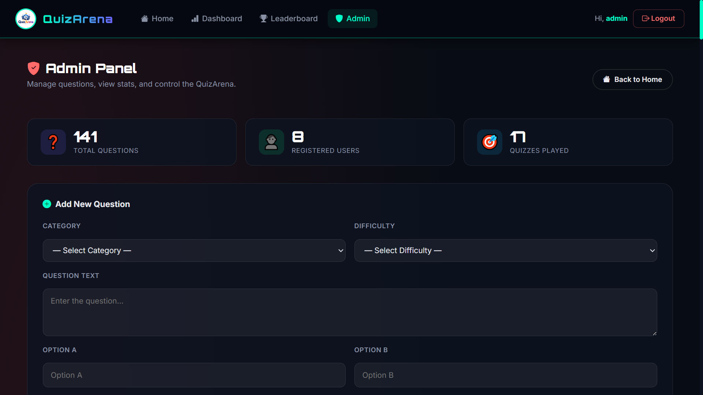

<p align="center">

</p>

<h1 align="center">
🏆 QuizArena
</h1>

<p align="center">
A Full-Stack Quiz Web Application built with Flask, Bootstrap 5, and SQLite.
</p>

<p align="center">


</p>

---

# ✨ Key Highlights

- 🏆 8 Quiz Categories with Easy and Hard modes
- ⏱️ 20-Second Countdown Timer per Question
- ✅ Instant Answer Feedback on Click
- 🎯 XP System with Level Progression
- 📊 Personal Dashboard with Stats
- 🏅 Real-Time Leaderboard
- 🛡️ Admin Panel for Question Management
- 🔐 Secure User Authentication
- 📱 Fully Responsive Design

---

# 📋 Table of Contents

- Overview
- Features
- Technology Stack
- Quiz Workflow
- Screenshots
- Installation
- Folder Structure
- Default Admin Account
- Notes
- Future Improvements
- Author

---

# 📖 Overview

QuizArena is a full-stack web quiz platform where users can test their knowledge across 8 different categories. Each category has Easy and Hard difficulty modes. Champion Mode randomly mixes questions from all categories for the ultimate challenge.

The application includes user registration and login, a 20-second timer per question with instant answer feedback, an XP-based progression system, a personal dashboard with performance stats, and a filterable leaderboard showing top players per category.

An admin panel allows adding and deleting questions from the question bank without touching the database directly.

---

# 🚀 Features

## 👤 User

- Register and Login
- Secure Password Hashing
- Session-Based Authentication
- Choose Quiz Category
- Select Easy or Hard Difficulty
- Answer 10 Random Questions per Quiz
- 20-Second Timer per Question
- Instant Correct / Wrong Feedback on Answer Click
- Correct Answer Revealed on Timeout
- View Score and XP Earned After Quiz
- Track Personal Stats on Dashboard
- View Leaderboard by Category

---

## 🎮 Quiz System

- 8 Categories — Gaming, Tech, Records, Riddles, Coding, Space, Science, Champion Mode
- Champion Mode mixes questions from all categories randomly
- 10 questions randomly selected per session
- Answer options shuffled every session
- Correct answer never exposed in page source during quiz
- Score validated server-side

---

## 📊 Dashboard

- Total Quizzes Played
- Average Score
- Best Score
- XP Points and Current Level
- Animated XP Progress Bar
- Per-Category Performance Bars
- Recent Quiz History

---

## 🏅 Leaderboard

- Filterable by All 8 Categories
- Podium Display for Top 3 Players
- Shows Score and Accuracy per Entry
- Highlights Current User's Rank

---

## 🛡️ Admin Panel

- Secure Admin-Only Access
- Add New Questions
- Select Category, Difficulty, Options, and Correct Answer
- Delete Existing Questions
- Filter Questions by Category or Difficulty
- Search Questions by Keyword
- View Total Questions, Users, and Quizzes Played

---

# 💻 Tech Stack

| Category | Technologies |
|----------|--------------|
| **Backend** | Python, Flask |
| **Frontend** | HTML5, CSS3, Bootstrap 5, JavaScript |
| **Database** | SQLite |
| **Authentication** | Flask Session, Werkzeug Password Hashing |
| **Template Engine** | Jinja2 |
| **WSGI Server** | Gunicorn |
| **Deployment** | Render |
| **Version Control** | Git & GitHub |

---

# 🎯 Quiz Workflow

```text
Register / Login
      │
      ▼
Choose Category
      │
      ▼
Select Difficulty (Easy / Hard / Champion)
      │
      ▼
Answer 10 Questions
      │
      ▼
20s Timer per Question
      │
      ▼
Instant Feedback on Click
      │
      ▼
View Result + XP Earned
      │
      ▼
Leaderboard Updated
```

---

# 📸 Screenshots

> Save all screenshots inside `static/images/screenshots/` using the filenames below.

---

## 🔐 Login Page

<p align="center">

</p>

---

## 🏠 Home — Dashboard

<p align="center">

</p>

---

## 🏠 Home — Category Selection

<p align="center">

</p>

---

## ⚙️ Select Difficulty

<p align="center">

</p>

---

## ❓ Quiz — Question with Timer

<p align="center">

</p>

---

## 🎉 Result Page

<p align="center">

</p>

---

## 📊 Dashboard

<p align="center">

</p>

---

## 🏅 Leaderboard

<p align="center">

</p>

---

## 🛡️ Admin Panel

<p align="center">

</p>

---

# ⚙️ Local Installation

## 1️⃣ Clone the Repository

```bash
git clone https://github.com/Awes313/QuizArena.git
cd QuizArena
```

---

## 2️⃣ Create Virtual Environment

### Windows

```bash
python -m venv venv
venv\Scripts\activate
```

### macOS / Linux

```bash
python3 -m venv venv
source venv/bin/activate
```

---

## 3️⃣ Install Dependencies

```bash
pip install -r requirements.txt
```

---

## 4️⃣ Add Images

Place the following images inside `static/images/`:

```
logo.png, home.jpg, gaming.jpg, tech.jpg, records.jpg,
riddles.jpg, coding.jpg, space.jpg, science.jpg,
champion.jpg, easy.jpg, hard.jpg, select.jpg
```

---

## 5️⃣ Initialize the Database

```bash
python create_db.py
```

Creates `quiz_app.db` with 140 questions and the default admin account.

---

## 6️⃣ Run the Application

```bash
python app.py
```

Open at:

```
http://127.0.0.1:5000
```

---

# 📁 Folder Structure

```text
QuizArena/
│
├── app.py
├── create_db.py
├── gunicorn.conf.py
├── render.yaml
├── requirements.txt
├── README.md
│
├── static/
│   ├── css/
│   │   └── style.css
│   ├── js/
│   │   └── main.js
│   └── images/
│       └── screenshots/
│
└── templates/
    ├── base.html
    ├── login.html
    ├── register.html
    ├── home.html
    ├── select.html
    ├── quiz.html
    ├── result.html
    ├── dashboard.html
    ├── leaderboard.html
    ├── admin.html
    ├── 404.html
    └── 500.html
```

---

# 🔑 Default Admin Account

| Username | Password |
|----------|----------|
| admin    | admin123 |

Access the admin panel at `/admin` after logging in.

---

# 📊 Feature Status

| Feature | Status |
|---------|:------:|
| User Registration | ✅ |
| Secure Login | ✅ |
| Password Hashing | ✅ |
| Session Management | ✅ |
| 8 Quiz Categories | ✅ |
| Easy & Hard Difficulty | ✅ |
| Champion Mode | ✅ |
| 20s Countdown Timer | ✅ |
| Instant Answer Feedback | ✅ |
| Correct Answer on Timeout | ✅ |
| XP System | ✅ |
| Level Progression | ✅ |
| Personal Dashboard | ✅ |
| Leaderboard | ✅ |
| Admin Panel | ✅ |
| Add / Delete Questions | ✅ |
| Responsive Design | ✅ |
| SQLite Database | ✅ |

---

# 🚀 Future Improvements

- 🏷️ Multiplayer Quiz Rooms
- 📧 Email Verification on Registration
- 📄 Export Results to PDF
- 📊 Advanced Analytics Dashboard
- 🐘 PostgreSQL for Production
- 🔔 Push Notifications
- 🐳 Docker Deployment

---

# 📄 License

This project is licensed under the **MIT License**.

You are free to use, modify, and distribute this project for educational and personal purposes.

---

# 👨‍💻 Author

## Mohammed Awes Tadas

**Python Full-Stack Developer**

📧 **Email**

mohamed7777awes@gmail.com

💼 **LinkedIn**

https://www.linkedin.com/in/awes313/

💻 **GitHub**

https://github.com/Awes313

---

# ⭐ Support

If you found this project helpful, please consider giving it a **Star ⭐** on GitHub.

---

<p align="center">

### 🏆 Built with ❤️ using Python & Flask

</p>
